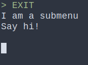
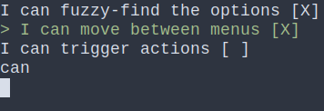

Python package to create command-line interactive menus in an extensible, simple and modular way.

# Installing

`pip install fuzzy-menu-cli`

# Example of usage

```python
from menu_cli import Menu, Action, Pick

main = Menu("My first menu", [
	Action("Say hi!", lambda: print("Hello world!")),
	Menu("I am a submenu", [
		Pick("I can move between menus and options"),
		Pick("I can fuzzy-find the options"),
		Pick("I can trigger actions"),
		Pick("I love this project!"),
	])
	Action("EXIT", lambda: pass,
])

main.navigate()

```




